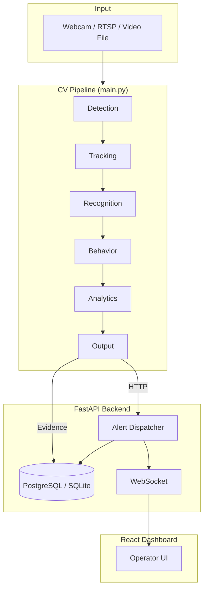

# Aegis — AI Smart Surveillance System

**Real-time computer vision surveillance with watchlist recognition, GPS-tagged alerts, and an operator command center.**

Aegis combines a modular CV pipeline, a FastAPI backend, and a React dashboard into one end-to-end platform. It detects people, vehicles, and weapons; matches faces against a watchlist; analyzes suspicious behavior; and dispatches alerts across the database, audit log, WebSockets, and optional webhooks — with camera GPS on every critical event.

---

## Table of Contents

- [Features](#features)
- [Architecture](#architecture)
- [Tech Stack](#tech-stack)
- [Prerequisites](#prerequisites)
- [Installation](#installation)
- [Quick Start](#quick-start)
- [Usage](#usage)
- [Configuration](#configuration)
- [Project Structure](#project-structure)
- [API Overview](#api-overview)
- [Testing](#testing)
- [Docker](#docker)
- [Documentation](#documentation)
- [License](#license)

---

## Features

### Computer Vision Pipeline

| Capability | Description |
|------------|-------------|
| **Human detection** | YOLOv8 person detection with configurable confidence |
| **Weapon detection** | Custom YOLO model for firearm / weapon identification |
| **Vehicle detection** | Vehicle tracking with ANPR (license plate OCR) |
| **Face recognition** | Watchlist matching via PostgreSQL + pgvector (SQLite fallback for local demos) |
| **Behavior analysis** | Loitering, rapid movement, erratic motion, pose estimation |
| **Anomaly detection** | Zone-based crowd and dwell-time anomalies |
| **Analytics** | Heatmaps, dwell time, and traffic-flow metrics |

### Alerting & Security

- Automated watchlist alerts across sound, DB, audit, WebSocket, and webhooks
- GPS coordinates and Google Maps link on every critical alert
- Throttled evidence snapshots (optional AES-256 encryption)
- Full audit trail for evidence saves and auth events
- Optional Slack / Discord / custom webhook dispatch

### Operator Dashboard

Live monitoring, alert center, watchlist, evidence, map, cameras, vehicles, incidents, analytics, reports, users, and settings — with WebSocket push, critical banners, and browser notifications.

### Multi-Camera Input

- Webcam, video file, or RTSP / IP camera
- Multi-camera mode via `config/cameras.yaml`
- RTSP reconnect with configurable transport (`tcp` / `udp`)
- Optional ONVIF PTZ and continuous DVR segment recording

---

## Architecture



**Pipeline stages:** Detection → Tracking → Recognition → Behavior → Analytics → Output

Stages live under `core/pipeline/stages/` and share a `FrameContext`, so each stage is independently testable and configurable.

**Alert path:** `OutputStage` → `NotificationHub` → `POST /api/v1/alerts/dispatch` → DB + audit + WebSocket + GPS + optional webhooks.

---

## Tech Stack

| Layer | Technologies |
|-------|--------------|
| **Computer Vision** | OpenCV, YOLOv8 + YOLOv8-pose (Ultralytics), face_recognition, EasyOCR, Deep SORT |
| **Backend** | FastAPI, SQLAlchemy, PostgreSQL + pgvector, JWT, AES-256 |
| **Frontend** | React 19, Vite 8 |
| **Infrastructure** | Docker Compose, Redis (optional), nginx deploy config |
| **Testing** | pytest, GitHub Actions CI |

---

## Prerequisites

| Requirement | Version / notes |
|-------------|-----------------|
| Python | 3.10+ |
| Node.js | 18+ |
| PostgreSQL | 14+ with `pgvector` (optional — SQLite works for local demos) |
| Model weights | Place under `models/` (see below) |

**Model weights** (not shipped in the repo):

| File | Purpose |
|------|---------|
| `models/yolov8s.pt` | Human detection |
| `models/weapon_yolo.pt` | Weapon detection |
| `models/yolov8l.pt` | Vehicle detection |

---

## Installation

### 1. Clone

```bash
git clone https://github.com/devXsadik/final-year-project.git
cd final-year-project
```

### 2. First-time setup

```bash
./scripts/setup.sh
# or: make setup
# or: ./setup_phase1.sh   # thin wrapper → scripts/setup.sh
```

Setup will:

1. Create the PostgreSQL database (when `psql` is available)
2. Copy `.env.example` → `.env`
3. Install Python dependencies from `requirements.txt`
4. Initialize the database schema
5. Ingest watchlist faces from `data/watchlist/`
6. Create the admin user (password printed once, or set `ADMIN_PASSWORD`)
7. Sync camera GPS into the database

For a zero-Postgres local demo, keep `USE_SQLITE=true` in `.env` (default in `.env.example`).

### 3. Frontend dependencies

```bash
cd frontend && npm install && cd ..
```

### 4. Demo video (recommended)

Place a short MP4 at:

```
data/demo/clips/sample.mp4
```

---

## Quick Start

**One command** — backend + CV pipeline + dashboard:

```bash
./run.sh
# or: make run
```

| Service | URL |
|---------|-----|
| Dashboard | http://localhost:5173 |
| API docs | http://localhost:8000/docs |
| Login | `admin` / password printed by `scripts/seed_demo.py` (or `ADMIN_PASSWORD`) |

```bash
./run.sh path/to/video.mp4   # custom video (plays at its own frame rate, looped)
./run.sh --no-pipeline       # API + dashboard only
make stop                    # free ports :8000 and :5173
```

`run.sh` always uses the project's own `.venv` (created on first run with Python 3.10–3.12) and runs
`scripts/check_env.py` first, so a broken system/conda Python can't take the backend down.

**Troubleshooting**

| Symptom | Fix |
|---|---|
| `Unable to open ...shape_predictor_68_face_landmarks.dat` / torch `libtorch_cpu.dylib` errors | You are on a broken Python. Delete nothing — just run `./run.sh`; it uses `.venv` |
| Forgot the admin password (it is printed only once) | `python scripts/seed_demo.py --reset-password` |
| Old recordings disappear | DVR retention deletes files older than `DVR_RETENTION_HOURS` (default 48). Set `0` to disable |
| Weapon / vehicle detection "OFF" | Add `models/weapon_yolo.pt` / `models/yolov8l.pt` — see Overview → Needs attention |

**Makefile shortcuts:**

```bash
make setup      # Full setup
make run        # Start full system
make stop       # Stop :8000 and :5173
make test       # Unit tests
make backend    # FastAPI only
make pipeline   # CV pipeline on demo video
make frontend   # React dev server
make ingest     # Re-ingest watchlist faces
```

---

## Usage

### Manual (three terminals)

```bash
uvicorn backend.main:app --reload --host 0.0.0.0 --port 8000
python main.py --video data/demo/clips/sample.mp4
cd frontend && npm run dev
```

### Webcam

```bash
python main.py
```

### Multi-camera (RTSP / IP)

```bash
python main.py --multi
```

Configure cameras in `config/cameras.yaml`. Use `${RTSP_GATE_1}` placeholders resolved from `.env`.

### Headless

```bash
python main.py --multi --no-display
# or
HEADLESS=true python main.py --video data/demo/clips/sample.mp4
```

### Pipeline keyboard shortcuts

| Key | Action |
|-----|--------|
| `Q` | Quit |
| `S` | Print per-stage timing stats |
| `T` | Toggle thermal camera view |

### Watchlist management

```bash
# 1. Add images under data/watchlist/CRIMINAL_XXX_Name/
# 2. Convert HEIC if needed
python scripts/convert_heic.py

# 3. Ingest encodings
python scripts/ingest_watchlist.py
```

### Pipeline evaluation

```bash
python scripts/evaluate_pipeline.py \
  --video data/demo/clips/sample.mp4 \
  --frames 200 \
  --output data/results/eval.json
```

---

## Configuration

### Environment (`.env`)

Copy from `.env.example`. Minimum variables:

| Variable | Purpose |
|----------|---------|
| `DATABASE_URL` | PostgreSQL or SQLite connection string |
| `USE_SQLITE` | `true` for local zero-setup demos |
| `SECRET_KEY` | JWT signing key (64+ chars in production) |
| `ENCRYPTION_KEY` | AES-256 evidence encryption |
| `INTERNAL_API_KEY` | Pipeline ↔ backend auth (**must match both sides**) |
| `BACKEND_URL` | Backend URL for pipeline event publishing |
| `RTSP_*` | IP camera stream URLs |

### YAML

| File | Purpose |
|------|---------|
| `config/config.yaml` | Pipeline settings, thresholds, default camera GPS |
| `config/cameras.yaml` | Multi-camera RTSP sources + per-camera GPS |
| `config/models.yaml` | Model registry (paths, tolerances, OCR languages) |

### Watchlist layout

```
data/watchlist/
├── CRIMINAL_001_Sadik/
│   ├── photo1.jpg
│   └── photo2.jpg
├── CRIMINAL_002_Tarik/
│   └── photo1.jpg
└── manifest.json          # optional metadata
```

Register display names under `criminal_names` in `config/config.yaml`.

---

## Project Structure

```
├── main.py                     # CLI entrypoint
├── paths.py                    # Central path constants
├── run.sh                      # One-command full system
├── setup_phase1.sh             # Wrapper → scripts/setup.sh
├── Makefile                    # Common commands
│
├── core/                       # Computer vision
│   ├── app/                    # Pipeline factory
│   ├── detectors/              # YOLO human / weapon / vehicle
│   ├── tracking/               # Multi-object trackers
│   ├── recognition/            # DB-backed face recognition
│   ├── analysis/               # Behavior, pose, ANPR, anomaly
│   ├── pipeline/               # Stage orchestration
│   ├── runtime/                # Camera worker loop
│   └── visualization/          # HUD rendering
│
├── backend/                    # FastAPI REST + WebSocket API
│   ├── api/                    # Route handlers
│   ├── services/               # Alert dispatcher
│   ├── models/                 # SQLAlchemy models
│   └── auth/                   # JWT authentication
│
├── frontend/                   # React operator dashboard
│   └── src/
│       ├── components/
│       ├── hooks/
│       ├── pages/
│       └── services/
│
├── utils/                      # Shared utilities
│   ├── alerts/                 # Notification hub, event publisher
│   ├── config/                 # Config loaders, camera registry
│   ├── data/                   # Evidence, reports, retention
│   ├── media/                  # Video / RTSP sources
│   └── system/                 # Logging, performance
│
├── data/
│   ├── watchlist/              # Face images for ingest
│   ├── demo/clips/             # Demo videos
│   └── results/                # Evaluation output
│
├── config/                     # YAML configuration
├── scripts/                    # Setup, seed, evaluate, deploy
├── deploy/                     # nginx configuration
├── docs/                       # Architecture, defense, development
└── tests/unit/                 # pytest suite
```

---

## API Overview

All routes are prefixed with `/api/v1/`. Interactive docs: http://localhost:8000/docs

| Endpoint | Description |
|----------|-------------|
| `POST /auth/login` | Operator authentication |
| `GET /alerts` | Alert history |
| `POST /alerts/dispatch` | Internal alert dispatch (pipeline) |
| `GET /faces` | Known persons / watchlist |
| `GET /evidence` | Evidence records |
| `GET /cameras` | Camera registry with GPS |
| `GET /map/cameras` | Map-ready camera pins |
| `GET /reports/incident` | Incident report |
| `WS /ws/alerts` | Live alert stream |
| `WS /ws/status` | System status stream |
| `GET /health` | Health check |

---

## Testing

```bash
pytest tests/unit/ -v
# or: make test
```

CI runs on push via GitHub Actions (`.github/workflows/ci.yml`).

---

## Docker

```bash
cp .env.example .env    # set secrets first
docker compose up -d
```

| Container | Port | Role |
|-----------|------|------|
| `surveillance_db` | 5433 | PostgreSQL |
| `surveillance_redis` | 6379 | Redis |
| `surveillance_backend` | 8000 | FastAPI API |
| `surveillance_main` | — | CV pipeline (demo video) |

---

## Documentation

| Document | Description |
|----------|-------------|
| [docs/ARCHITECTURE.md](docs/ARCHITECTURE.md) | System design, data flow, module map |
| [docs/DEFENSE.md](docs/DEFENSE.md) | Graduation demo script and checklist |
| [docs/DEVELOPMENT.md](docs/DEVELOPMENT.md) | Developer setup and conventions |
| [AGENTS.md](AGENTS.md) | Contributor / agent quick reference |

---

## Alert Flow

When a watchlisted person is detected on **any camera**:

1. **Pipeline** — red HUD banner, alarm sound, evidence snapshot
2. **NotificationHub** — `POST /api/v1/alerts/dispatch` with GPS
3. **Alert Dispatcher** — DB save, audit log, WebSocket broadcast
4. **Dashboard** — sound, critical banner, browser notification, map pin
5. **Webhooks** — optional external dispatch (Slack, Discord, etc.)

---

## Contributing

This is a final-year academic project. Issues and pull requests are welcome.

---

## License

Academic / final-year project — see repository owner for usage terms.

**Aegis** — AI Smart Surveillance System
