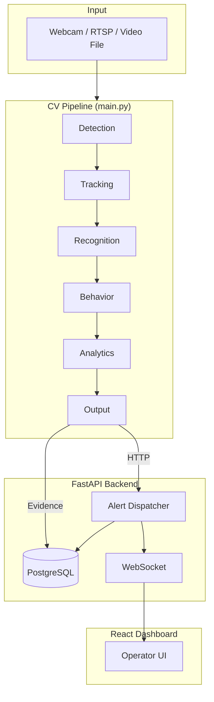

# AI Smart Surveillance System (Ai-SSS)

**Production-grade intelligent surveillance with real-time criminal detection, GPS-tagged alerts, and a secure operator dashboard.**

Ai-SSS is a final-year project that combines a modular computer-vision pipeline, a FastAPI backend, and a React dashboard into one end-to-end surveillance platform. It detects humans, vehicles, and weapons; recognizes watchlisted individuals; analyzes suspicious behavior; and dispatches automated alerts across sound, database, audit logs, WebSockets, and webhooks — with pinpoint camera GPS on every critical event.

---

## Table of Contents

- [Features](#features)
- [Architecture](#architecture)
- [Tech Stack](#tech-stack)
- [Prerequisites](#prerequisites)
- [Installation](#installation)
- [Quick Start](#quick-start)
- [Usage](#usage)
- [Configuration](#configuration)
- [Project Structure](#project-structure)
- [API Overview](#api-overview)
- [Testing](#testing)
- [Docker](#docker)
- [Documentation](#documentation)

---

## Features

### Computer Vision Pipeline

| Capability | Description |
|------------|-------------|
| **Human detection** | YOLOv8-based person detection with confidence thresholds |
| **Weapon detection** | Custom YOLO model for firearm / weapon identification |
| **Vehicle detection** | Vehicle detection + tracking with ANPR (license plate OCR) |
| **Face recognition** | Watchlist matching via PostgreSQL + pgvector encodings |
| **Behavior analysis** | Loitering, rapid movement, erratic motion, pose estimation |
| **Anomaly detection** | Zone-based crowd and dwell-time anomalies |
| **Analytics** | Heatmaps, dwell time, and traffic-flow metrics |

### Alerting & Security

- **Automated criminal alerts** — watchlist match on any camera triggers all channels simultaneously
- **GPS pinpointing** — every alert carries camera latitude/longitude and a Google Maps link
- **Evidence capture** — throttled snapshots saved to disk (AES-256 optional) and PostgreSQL
- **Audit trail** — all evidence saves and auth events logged to `audit_logs`
- **WebSocket live feed** — instant push to the operator dashboard
- **Webhook dispatch** — optional Slack/Discord/custom endpoints via `.env`

### Operator Dashboard

- Live alert feed with critical banner, sound, and browser notifications
- Tabs: **Live Feeds · Event Logs · Known Faces · Evidence · Map · Settings**
- Interactive camera map with GPS pins
- Incident report generation via API

### Multi-Camera & IP Support

- Single webcam, video file, or RTSP/IP camera input
- Multi-camera mode from `config/cameras.yaml`
- RTSP reconnect with configurable transport (`tcp` / `udp`)

---

## Architecture



**Pipeline stages:** Detection → Tracking → Recognition → Behavior → Analytics → Output

Each stage is a pluggable module under `core/pipeline/stages/`. Data flows through a shared `FrameContext` object, making stages independently testable and configurable.

---

## Tech Stack

| Layer | Technologies |
|-------|-------------|
| **Computer Vision** | OpenCV, YOLOv8 (Ultralytics), MediaPipe, face_recognition, EasyOCR, Deep SORT |
| **Backend** | FastAPI, SQLAlchemy, PostgreSQL, pgvector, JWT auth, AES-256 encryption |
| **Frontend** | React 19, Vite |
| **Infrastructure** | Docker Compose, nginx (deploy config) |
| **Testing** | pytest, GitHub Actions CI |

---

## Prerequisites

| Requirement | Version |
|-------------|---------|
| Python | 3.10+ |
| Node.js | 18+ |
| PostgreSQL | 14+ with `pgvector` extension |
| macOS (optional) | For pipeline alarm sound (`afplay`) |

**Model weights** (not included in repo — place in `models/`):

- `yolov8s.pt` — human detection
- `weapon_yolo.pt` — weapon detection
- `yolov8l.pt` — vehicle detection

---

## Installation

### 1. Clone the repository

```bash
git clone https://github.com/<your-username>/final-year-project.git
cd final-year-project
```

### 2. Run setup

```bash
chmod +x setup_phase1.sh
./setup_phase1.sh
```

Setup will:

1. Create the PostgreSQL database
2. Copy `.env.example` → `.env`
3. Install Python dependencies
4. Initialize the database schema
5. Ingest watchlist face images from `data/watchlist/`
6. Seed demo admin user (`admin` / `admin123`)
7. Sync camera GPS coordinates to the database

### 3. Install frontend dependencies

```bash
cd frontend && npm install && cd ..
```

### 4. Add demo video (recommended)

Place a short MP4 clip at:

```
data/demo/clips/sample.mp4
```

This ensures a reliable demo without depending on a live camera.

---

## Quick Start

**One-command defense demo** (backend + pipeline + dashboard):

```bash
./scripts/run_defense_demo.sh
```

| Service | URL |
|---------|-----|
| Dashboard | http://localhost:5173 |
| API docs | http://localhost:8000/docs |
| Login | `admin` / `admin123` |

**Makefile shortcuts:**

```bash
make setup      # Run full setup
make demo       # Start defense demo
make test       # Run unit tests
make backend    # Start FastAPI only
make pipeline   # Start CV pipeline on demo video
make frontend   # Start React dev server
make ingest     # Re-ingest watchlist faces
```

---

## Usage

### Single camera (webcam)

```bash
uvicorn backend.main:app --reload --host 0.0.0.0 --port 8000   # Terminal 1
python main.py                                                  # Terminal 2
cd frontend && npm run dev                                      # Terminal 3
```

### Video file (recommended for demos)

```bash
python main.py --video data/demo/clips/sample.mp4
```

### Multi-camera (RTSP / IP cameras)

```bash
python main.py --multi
```

Configure cameras in `config/cameras.yaml`. Use `${RTSP_GATE_1}` placeholders resolved from `.env`.

### Headless mode (no OpenCV window)

```bash
python main.py --multi --no-display
# or
HEADLESS=true python main.py --video data/demo/clips/sample.mp4
```

### Pipeline keyboard shortcuts

| Key | Action |
|-----|--------|
| `Q` | Quit |
| `S` | Print per-stage timing stats |
| `T` | Toggle thermal camera view |

### Watchlist management

```bash
# 1. Add face images to data/watchlist/CRIMINAL_XXX_Name/
# 2. Convert HEIC images (macOS / Pillow)
python scripts/convert_heic.py

# 3. Ingest encodings into PostgreSQL
python scripts/ingest_watchlist.py
```

### Performance evaluation (thesis / benchmarking)

```bash
python scripts/evaluate_pipeline.py \
  --video data/demo/clips/sample.mp4 \
  --frames 200 \
  --output data/results/eval.json
```

---

## Configuration

### Environment variables (`.env`)

Copy from `.env.example` and set at minimum:

| Variable | Purpose |
|----------|---------|
| `DATABASE_URL` | PostgreSQL connection string |
| `SECRET_KEY` | JWT signing key (64+ chars in production) |
| `ENCRYPTION_KEY` | AES-256 evidence encryption |
| `INTERNAL_API_KEY` | Pipeline ↔ backend auth (must match on both sides) |
| `BACKEND_URL` | Backend URL for pipeline event publishing |
| `RTSP_*` | IP camera stream URLs |

### YAML configuration

| File | Purpose |
|------|---------|
| `config/config.yaml` | Main pipeline settings, thresholds, default camera GPS |
| `config/cameras.yaml` | Multi-camera RTSP sources + per-camera GPS |
| `config/models.yaml` | Model registry (paths, tolerances, OCR languages) |

### Criminal watchlist

Add person folders under `data/watchlist/`:

```
data/watchlist/
├── CRIMINAL_001_Sadik/
│   ├── photo1.jpg
│   └── photo2.jpg
├── CRIMINAL_002_Tarik/
│   └── photo1.jpg
└── manifest.json          # optional metadata
```

Register names in `config/config.yaml` under `criminal_names`.

---

## Project Structure

```
├── main.py                     # CLI entrypoint
├── paths.py                    # Central path constants
├── setup_phase1.sh             # Setup wrapper
├── Makefile                    # Common commands
│
├── core/                       # Computer vision
│   ├── app/                    # Pipeline factory
│   ├── detectors/              # YOLO human / weapon / vehicle
│   ├── tracking/               # Multi-object trackers
│   ├── recognition/            # DB-backed face recognition
│   ├── analysis/               # Behavior, pose, ANPR, anomaly
│   ├── pipeline/               # Stage orchestration
│   ├── runtime/                # Camera worker loop
│   └── visualization/          # HUD rendering
│
├── backend/                    # FastAPI REST + WebSocket API
│   ├── api/                    # Route handlers
│   ├── services/               # Alert dispatcher
│   ├── models/                 # SQLAlchemy models
│   └── auth/                   # JWT authentication
│
├── frontend/                   # React operator dashboard
│   └── src/
│       ├── components/         # UI components
│       ├── hooks/              # WebSocket, auto-alerts
│       └── services/           # API client
│
├── utils/                      # Shared utilities
│   ├── alerts/                 # Notification hub, event publisher
│   ├── config/                 # Config loaders, camera registry
│   ├── data/                   # Evidence, reports, retention
│   ├── media/                  # Video / RTSP sources
│   └── system/                 # Logging, performance
│
├── data/
│   ├── watchlist/              # Face images for ingest
│   ├── demo/clips/             # Demo videos
│   └── results/                # Evaluation output
│
├── config/                     # YAML configuration
├── scripts/                    # Setup, seed, evaluate, deploy
├── deploy/                     # nginx configuration
├── docs/                       # Architecture, defense, development guides
└── tests/unit/                 # pytest suite
```

---

## API Overview

All routes are prefixed with `/api/v1/`. Interactive docs at `http://localhost:8000/docs`.

| Endpoint | Description |
|----------|-------------|
| `POST /auth/login` | Operator authentication |
| `GET /alerts` | List alert history |
| `POST /alerts/dispatch` | Internal alert dispatch (pipeline) |
| `GET /faces` | Known persons / watchlist |
| `GET /evidence` | Evidence records |
| `GET /cameras` | Camera registry with GPS |
| `GET /map/cameras` | Map-ready camera pins |
| `GET /reports/incident` | Generate incident report |
| `WS /ws/alerts` | Live alert WebSocket stream |
| `WS /ws/status` | System status WebSocket |
| `GET /health` | Health check |

---

## Testing

```bash
pytest tests/unit/ -v
```

CI runs on push via GitHub Actions (`.github/workflows/ci.yml`).

---

## Docker

```bash
cp .env.example .env        # configure secrets first
docker-compose up -d
```

Services:

| Container | Port | Role |
|-----------|------|------|
| `surveillance_db` | 5433 | PostgreSQL |
| `surveillance_backend` | 8000 | FastAPI API |
| `surveillance_main` | — | CV pipeline (demo video) |

---

## Documentation

| Document | Description |
|----------|-------------|
| [docs/ARCHITECTURE.md](docs/ARCHITECTURE.md) | System design, data flow, module map |
| [docs/DEFENSE.md](docs/DEFENSE.md) | Graduation demo script and checklist |
| [docs/DEVELOPMENT.md](docs/DEVELOPMENT.md) | Developer setup and conventions |
| [AGENTS.md](AGENTS.md) | Contributor / agent reference |

---

## Alert Flow (Criminal Detection)

When a watchlisted person is detected on **any camera**:

1. **Pipeline** — red HUD banner, alarm sound, evidence snapshot
2. **NotificationHub** — `POST /api/v1/alerts/dispatch` with GPS coordinates
3. **Alert Dispatcher** — saves to DB, writes audit log, broadcasts WebSocket
4. **Dashboard** — sound, critical banner, browser notification, map pin update
5. **Webhooks** — optional external dispatch (Slack, Discord, etc.)

---

## Contributing

This is a final-year academic project. For issues or suggestions, open a GitHub issue or submit a pull request.

---

## Author

Final Year Project — AI Smart Surveillance System (Ai-SSS) v5.0
