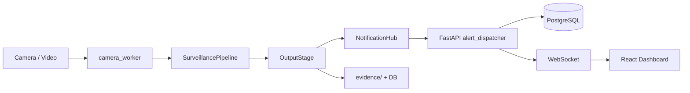

# Architecture

Aegis (AI Smart Surveillance System) — layered pipeline + API + dashboard.

## Layout

```
aegis/
├── main.py                 # CLI entrypoint (single / multi camera)
├── paths.py                # Central path constants
├── config/                 # YAML configuration
├── core/                   # Computer vision pipeline
│   ├── app/                # Pipeline factory
│   ├── detectors/          # YOLO human / weapon / vehicle
│   ├── tracking/           # Multi-object trackers
│   ├── recognition/        # Face recognition (DB-backed)
│   ├── analysis/           # Behavior, pose, ANPR, anomaly, analytics
│   ├── pipeline/           # Stage orchestration
│   ├── runtime/            # Camera loop worker
│   └── visualization/      # HUD rendering
├── backend/                # FastAPI REST + WebSocket API
├── frontend/               # React dashboard
├── utils/                  # Shared utilities
│   ├── alerts/             # Notification hub + event publisher
│   ├── config/             # Config loaders, camera registry, models
│   ├── data/               # Evidence, reports, retention
│   ├── media/              # Video / RTSP sources
│   └── system/             # Logging, performance
├── data/
│   ├── watchlist/          # Face images for ingest
│   ├── demo/clips/         # Demo videos
│   └── results/            # Evaluation output
├── scripts/                # Setup, seed, evaluate, deploy
├── deploy/                 # nginx and deployment configs
├── docs/                   # Defense and development guides
└── tests/unit/             # Pytest suite
```

## Data flow



## Pipeline stages

1. **Detection** — humans, vehicles, weapons (YOLO)
2. **Tracking** — persistent track IDs
3. **Recognition** — face match against PostgreSQL watchlist
4. **Behavior** — pose, loitering, ANPR, zone anomalies
5. **Analytics** — heatmaps, dwell, traffic flow
6. **Output** — evidence save, alerts, HUD metadata

## Alert path

`OutputStage` → `NotificationHub` → `event_publisher.dispatch_alert` →
`POST /api/v1/alerts/dispatch` → `alert_dispatcher` → audit log + DB + WebSocket + webhooks.

GPS from `config/cameras.yaml` is attached to every alert payload.

## Key modules

| Concern | Location |
|---------|----------|
| Build pipeline | `core/app/factory.py` |
| Run cameras | `core/runtime/camera_worker.py` |
| Paths | `paths.py` |
| Watchlist ingest | `scripts/ingest_watchlist.py` |
| Launcher | `run.sh` |
